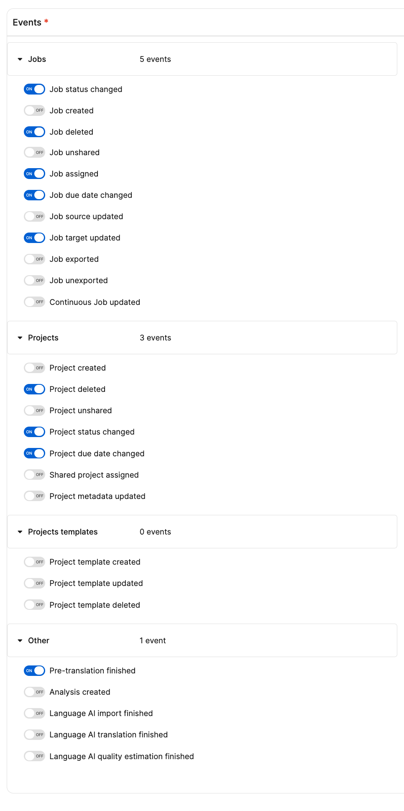
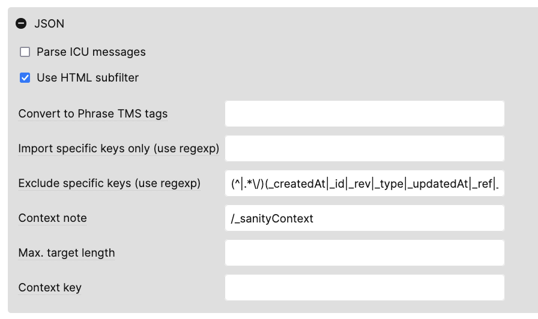
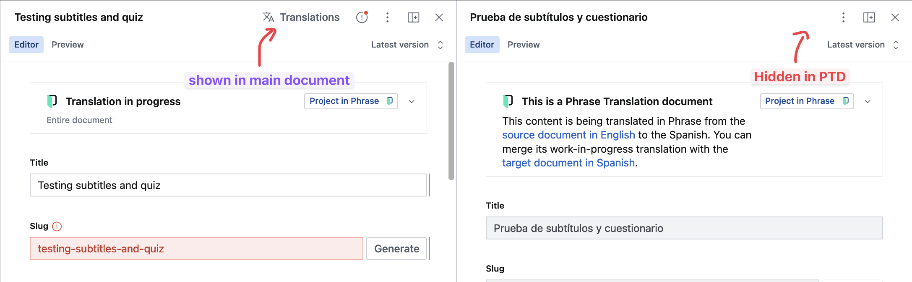

# Phrase content translation plugin for Sanity.io

Translate [Sanity.io](https://sanity.io) content with [Phrase](https://phrase.com), directly from the Sanity studio.

- ⚡ **Real-time previews:** translations are kept in-sync to allow linguists and translators to see preview changes in real-time.
- ∆ **Smart re-translations:** the plugin diffs what content has changed since the last translation, and only sends those changes to Phrase.
- 🔗 **Automatic references translation:** when issuing translations, editors can choose to also translate documents referenced by the current, and the plugin will automatically link them by target language.
- 🌐 **Flexible schemas:** no matter the structure, this plugin will adapt to it and ensure the final translated content is according to your Sanity schemas.
- ✅ **Keep your Phrase workflows:** the translation workflows your team already has in Phrase will remain the same. No need to retrain or reconfigure your operations.

⚠️ This plugin only supports document-level translations, such as done by [Sanity's official document-internationalization plugin](https://github.com/sanity-io/document-internationalization). Field-level translations are not supported.

https://github.com/tinloof/sanity-plugin-phrase/assets/27744332/6914fee8-c09e-4e15-9b78-7619feb6ff35

## Installation

```bash
npm install sanity-plugin-phrase

# or pnpm, yarn, bun
```

```ts
// sanity.config.(js|ts)
import {
  phrasePlugin,
  documentInternationalizationAdapter,
} from 'sanity-plugin-phrase'

const PHRASE_CONFIG = definePhraseOptions({
  /**
   * The i18n adapter to use for this plugin.
   * It'll be responsible for fetching and modifying documents for each target language.
   *
   * See below for more information on adapters.
   */
  i18nAdapter: documentInternationalizationAdapter(),

  /**
   * Sanity schema types the plugin can translate
   */
  translatableTypes: ['page', 'post', 'course', 'lesson', 'definition'],

  /**
   * Language code of all languages users can translate to.
   * Should be the same as the one stored in your Sanity documents and used by your front-end. The plugin will automatically translate it to Phrase's format.
   */
  supportedTargetLangs: ['cz', 'es', 'pt', 'fr', 'de', 'it', 'nl', 'pl', 'ru'],

  /**
   * Language code of the source language that will be translated.
   * Should be the same as the one stored in your Sanity documents and used by your front-end. The plugin will automatically translate it to Phrase's format.
   */
  sourceLang: 'en',

  /**
   * As defined by your Phrase account's settings
   * Either `eu` or `us`
   */
  phraseRegion: 'us|eu',

  /**
   * The URL to your configured plugin backend API.
   *
   * **Note:** follow the steps for setting up the endpoint, outlined below
   */
  apiEndpoint: 'https://my-site.com/api/phrase',

  /**
   * Used to redirect linguists from the Phrase dashboard to the front-end preview of their translations.
   */
  getDocumentPreview: async (doc, sanityClient) => {
    const publishedId = doc._id.replace('drafts.', '')
    return `${process.env.NEXT_PUBLIC_FRONT_END_URL}/api/draft?publishedId=${publishedId}`
  },

  /**
   * Phrase project templates your editors can use when requesting translations.
   *
   * **Note:** follow the steps for setting templates, outlined below
   */
  phraseTemplates: [
    {
      templateUid: '1jYg0Pc1d8kAHUyM0tgdmt',
      label: '[Sanity.io] Default template',
    },
  ],

  /**
   * @optional
   * In case you want to show or hide the Phrase dashboard according to user privileges.
   *
   * Receives a context with the current user and document and must return a boolean.
   */
  isPhraseDashboardHidden: (context) =>
    !(context.currentUser.roles || []).some((r) => r.name === 'admin'),
})

export default defineConfig({
  // ...
  plugins: [
    // ...
    phrasePlugin(PHRASE_CONFIG),
  ],
})
```

### `apiEndpoint`

This is the endpoint that the plugin will use to communicate with the Sanity Studio. It is used to authenticate to Phrase's API, receive its webhooks, and to receive user requests from the Sanity studio.

You must create a custom API endpoint in your Sanity project to handle these requests. One of the easiest ways to do this is to use serverless functions via front-end frameworks like NextJS, Remix, SvelteKit or Nuxt.

You can access configure the handler with a Request -> Response pattern via `import { createRequestHandler } from 'sanity-plugin-phrase/backend'` or use the internal handler directly via `import { createInternalHandler } from 'sanity-plugin-phrase/backend'`. In either case, make sure you handle CORS requests correctly, in case your studio and endpoint are in different origins.

Here's an example using NextJS v14 API route that has very permissive CORS settings:

```ts
// src/pages/api/phrase.ts
// Next.js API route: https://nextjs.org/docs/pages/building-your-application/routing/api-routes
import type { NextApiRequest, NextApiResponse } from 'next'
import { PHRASE_CONFIG } from 'phraseConfig'
import { createInternalHandler } from 'sanity-plugin-phrase/backend'
import { writeToken } from '~/lib/sanity.api'
import { client } from '~/lib/sanity.client'

const phraseHandler = createInternalHandler({
  phraseCredentials: {
    userName: process.env.PHRASE_USER_NAME || '',
    password: process.env.PHRASE_PASSWORD || '',
    region: process.env.NEXT_PUBLIC_PHRASE_REGION || 'eu',
  },
  sanityClient: client.withConfig({ token: writeToken }),
  pluginOptions: PHRASE_CONFIG,
})

export default async function handler(
  req: NextApiRequest,
  res: NextApiResponse,
) {
  res.setHeader('Access-Control-Allow-Origin', '*')
  res.setHeader('Access-Control-Allow-Methods', 'POST, OPTIONS')
  res.setHeader('Access-Control-Allow-Headers', '*')

  if (req.method?.toUpperCase() === 'OPTIONS') {
    res.status(200).json({})
    return
  }

  if (
    !req.method ||
    (req.method.toUpperCase() !== 'POST' && req.method.toUpperCase() !== 'GET')
  ) {
    res.status(405).json({ error: 'Method not allowed' })
    return
  }

  const phraseRes = await phraseHandler(
    req.method.toUpperCase() === 'POST' ? req.body : req.query,
  )
  const resBody = await phraseRes.json().catch(() => {})

  Array.from(phraseRes.headers.entries()).forEach((value) => {
    res.setHeader(value[0], value[1])
  })
  res.status(phraseRes.status).json(resBody)
}
```

**Note**: the NextJS's app directory is currently not supported as it incorrectly parses the backend handler as a React client component.

### i18n adapters

Sanity has no prescriptive approach to internationalization, and there are many ways to implement it. This plugin uses an adapter pattern to allow you to configure how your content is structured and how it should be translated.

Currently, the only adapter available is `documentInternationalizationAdapter`, which is the one used by Sanity's official [document-internationalization plugin](https://github.com/sanity-io/document-internationalization) (version `^2.0.0`). File an issue if you need a specific adapter or refer to this repository's `package/src/adapters/document-internationalization.ts` for an example on how to implement your own.

### Limiting editor access

You can limit which editors can access the Phrase dashboard by implementing the `isPhraseDashboardHidden` option. This function is equivalent to the one you’d pass to the `hidden` property of a field in Sanity. It receives a context with the current user and document and must return a boolean.

For example, I could limit access to the Phrase dashboard to users with the `admin` role:

```ts
const PHRASE_CONFIG = definePhraseOptions({
  // ...
  isPhraseDashboardHidden: (context) => {
    const isAdmin = (context.currentUser.roles || []).some(
      (r) => r.name === 'admin',
    )
    // Hide if not an admin
    return !isAdmin
  },
})
```

## Configuring Phrase

### Creating webhooks

Go into your Phrase's webhook settings and create a new webhook with the following settings:

- URL: the URL to your plugin's API endpoint, as configured in the `apiEndpoint` option.
- Events:
  - Jobs
    - Job deleted
    - Job assigned
    - Job due date changed
    - Job target updated
  - Projects
    - Project deleted
    - Project status changed
    - Project due date changed
  - Other
    - Pre-translation finished



This will ensure that the plugin is notified of any changes to your Phrase projects, and can keep the Sanity data in sync.

### Setting up your Phrase project template(s)

Configure your [Phrase project template(s)](https://support.phrase.com/hc/en-us/articles/5709647439772-Project-Templates-TMS-) with the properties you need for your workflows and team requirements. You can offer users one or more templates to choose from when ordering a new translation.

For the plugin, the most important settings to get right are:

**JSON file import**

- Exclude specific keys (use regexp): `(^|.*\/)(_createdAt|_id|_rev|_type|_updatedAt|_ref|_key|_sanityRev|_sanityContext|_strengthenOnPublish|phraseMetadata|_spanMeta|_blockMeta|_diff|marks|YOUR_IGNORED_KEYS_HERE|(_createdAt|_id|_rev|_type|_updatedAt|_ref|_key|_sanityRev|_sanityContext|_strengthenOnPublish|phraseMetadata|_spanMeta|_blockMeta|_diff|marks|YOUR_IGNORED_KEYS_HERE)/.*)`
  - You must exclude localization-specific data, like the `language` of a given document if you're using `@sanity/document-internationalization`
  - Include any project-specific keys that you don't want to be translated, such as a `slug` for content using the same path across all languages. Replace `YOUR_IGNORED_KEYS_HERE` with a pipe-separated list of keys to ignore.
  - **Note**: the expression above includes duplicated keys on purpose to ensure they get ignored by Phrase's RegEx parser. Make sure you duplicate them correctly.
- Context note: `/_sanityContext`



**Source language**

Currently, this plugin operates from the assumption of having a single source language. The project template(s) must have the same source as the one configured in the plugin's `sourceLanguage`.

**Target languages**

Make sure the languages you choose in Phrase are in sync to what you have in the plugin's configuration.

## Previewing ongoing translations (`getDocumentPreview`)

This plugin creates Phrase Translation Documents (PTDs) that exist in parallel to the target languages' documents. This allows editors to preview the translations in real-time, even before merging the translation's content with the final target.

In order to preview these translations, you must implement a preview handler in your front-end. This handler will receive the PTD's ID and must return the preview URL for that document. If you're doing previews using the document's slug or relative path (ex: `/LANG/blog/my-post`), make sure you fetch content from the PTD document, and not the target language's document:

```ts
// Simplified pseudo-code for loading data in the front-end

const id = searchParams?.id // /page-path?id=DOC_ID
const slug = pathParams.slug // /page-path/[...SLUG]

// ❌ Before
const { data } = await sanityClient.fetch(`*[slug.current == $slug]`, { slug })

// ✅ After - ensures the exact desired document is fetched if there's a previewId
const { data } = await sanityClient.fetch(
  id ? `*[_id == $documentId]` : `*[slug.current == $slug]`,
  { id, slug },
)
```

Finally, in order to allow Phrase linguists from refreshing content in the front-end, you'll need to expose a button for them to request fresh data from Phrase. This can be done by adding a button to your front-end that calls the `refresh` action of your plugin's API endpoint. Here's an example with React:

```tsx
import { MouseEvent, useState } from 'react'
import { requestPTDRefresh, isPtdId } from 'sanity-plugin-phrase/utils'

function RefreshPTDButton({ previewedDocId }: { previewedDocId: string }) {
  const [state, setState] = useState<'idle' | 'refreshing'>('idle')

  if (!previewedDocId || !isPtdId(previewedDocId)) {
    return null
  }

  async function handleRefresh(e: MouseEvent) {
    e.preventDefault()

    setState('refreshing')
    const result = await requestPTDRefresh({
      ptdId: previewedDocId,
      apiEndpoint,
    })

    if (result.success === false) {
      // Notify users of errors as you see fit
    }

    setState('idle')
  }

  return (
    <button onClick={handleRefresh} disabled={state === 'refreshing'}>
      Refresh Phrase data
    </button>
  )
}
```

The above is needed because Phrase's API does not notify webhooks on every translation segment change, only when jobs' statuses change. As a result, we need to manually ask for fresh data when in the middle of a job.

## Limitations and precautions

### Exclude PTDs from your queries

Phrase Translation Documents (PTDs) are copies of source and target documents, and are stored in the same dataset. This means that if you're querying documents from Sanity, you'll get both the source and target documents, as well as their PTDs. This can lead to duplication or incorrect data in the front-end. To ensure this doesn't happen, make sure you exclude PTDs from your queries:

```ts
import { NOT_PTD } from 'sanity-plugin-phrase/utils'

// ❌ Before - can return the PTD instead of the desired document
const lessonQuery = `*[_type == 'lesson' && slug.current == $slug && publishedAt < now() && language == $language]`

// ✅ After - excludes PTDs
const lessonQuery = `*[
  // ...same filters
  && ${NOT_PTD}
]`

// NOT_PTD: `phraseMetadata._type != "phrase.ptd.meta"`
```

### This plugin assumes content is the same across translations

If the structure between languages is different, the plugin may not be able to apply the changes between translations correctly. For example:

- A source document was translated to Tagalog, and the translation was merged successfully
- Later, editors changed one of its paragraph's content
- But that same paragraph was deleted from the Tagalog version
- In a new translation, the paragraph will be translated in Phrase, but the plugin will not be able to apply the change as it won't find where to place it.

This applies mostly to deleted content. Editors will be able to add language-specific blocks/paragraphs and edit content in place without issues, but it's important to keep in mind this plugin is intended for re-using content across translations.

### Source content changes in Sanity while translations are ongoing will be ignored

They'll be saved to the source document as usual, but the plugin will not update the source content in Phrase. This is to avoid overwriting translations that are in progress.

Instead, users will need to finish ongoing translations before issuing a new one to capture these changes. As such, it's generally advised to only issue translations when the content is reviewed and final.

### Rule: users cannot change a Phrase project's target languages

This plugin assumes that the target languages of a Phrase project will not change. If they do, the plugin will not be able to keep the translations in sync.

### Maximum translated reference depth: 3

This plugin will automatically translate referenced documents when issuing a translation. However, it will only do so up to 3 levels deep. This is to avoid infinite loops and to keep execution times low.

### When using the document-internationalization plugin, hide the "Translations" button from PTDs

To avoid confusion, it's recommended to hide the "Translations" button from Sanity's document-internationalization plugin in PTDs.



This can be done by adding a custom `languageFilter` to the document-internationalization plugin:

```ts
const studioConfig = defineConfig({
  // ...
  document: {
    unstable_languageFilter: (prev, ctx) => {
      const { schemaType, documentId } = ctx

      return TRANSLATABLE_SCHEMAS.includes(schemaType as any) &&
        documentId &&
        !isPtdId(documentId)
        ? [
            ...prev,
            (props) =>
              DocumentInternationalizationMenu({ ...props, documentId }),
          ]
        : prev
    },
  },
})
```

## Developing

This repository uses:

- [Yarn v4](https://yarnpkg.com/) to manage dependencies across the package and demos without duplication
- [Turborepo](https://turbo.build/repo) to orchestrate build & dev commands
- [Changesets](https://github.com/changesets/changesets) to manage releases and versioning
- ESLint and prettier for linting & formatting
- [Bun](https://bun.sh/) for running tests found in `package/tests`

To start developing, run:

```bash
yarn install # using Yarn v4

yarn dev # starts the demo app and plugin watcher

# Open localhost:3000/studio
```

You'll need to create `.env`` files and include the right environment variables to make it work:

- Duplicate `demo-nextjs/.env.example` into `demo-nextjs/.env` and populate its values
- `package/.env.example` into `package/.env`

## Credits

This plugin was built by [Tinloof](https://tinloof.com/) for [Phrase](https://phrase.com/), with close touch and lots of feedback from [Braze](https://www.braze.com/)
